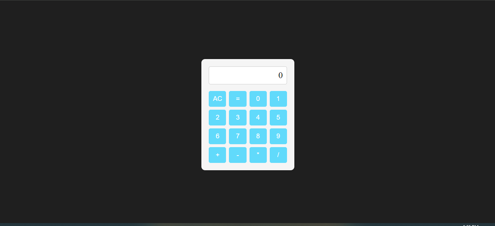

# JavaScript Calculator

This JavaScript Calculator is a project completed as part of the Front End Development Libraries Certification on FreeCodeCamp. It is a web-based calculator that allows users to perform basic arithmetic operations.

## Features

- Addition, subtraction, multiplication, and division operations.
- Ability to chain multiple operations together.
- Clear button to reset the calculator.
## Demo

You can try out the calculator by visiting the live demo [here](https://658d51bf978b389fce8f5f5e--effulgent-stroopwafel-310af2.netlify.app/).

## Technologies Used

- REACT
- Sass
